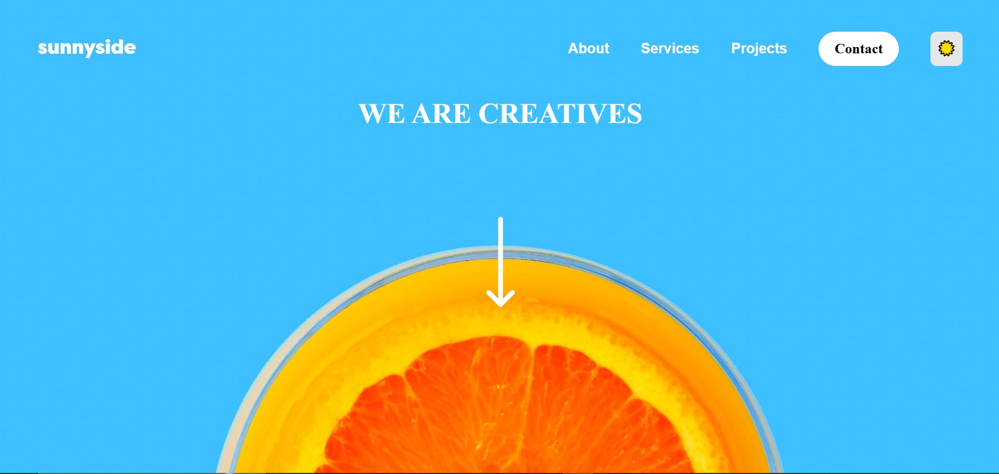
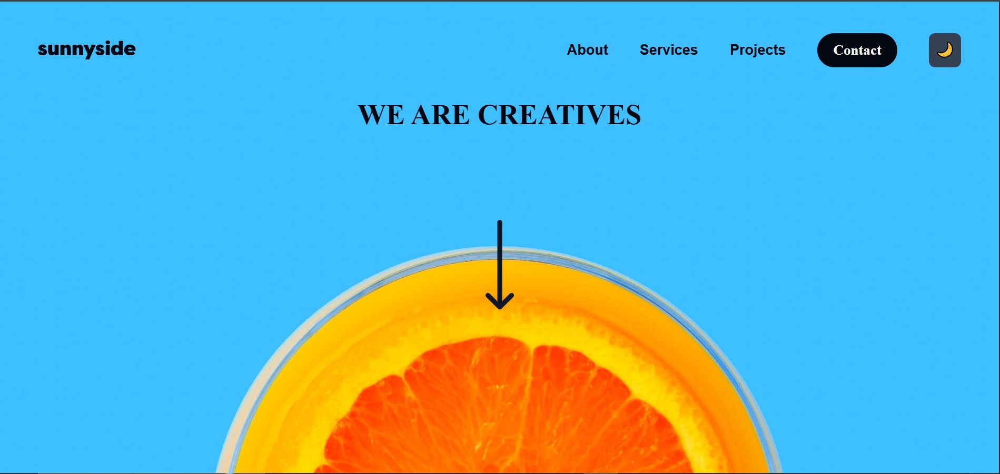

# Frontend Mentor - Project Solution

This is a solution to the [Agency landing page](https://www.frontendmentor.io/challenges/agency-landing-page-7yVs3B6ef). Frontend Mentor challenges help you improve your coding skills by building realistic projects.

## Table of Contents

- [Overview](#overview)
  - [The Challenge](#the-challenge)
  - [Screenshot](#screenshot)
  - [Links](#links)
- [My Process](#my-process)
  - [Built With](#built-with)
  - [What I Learned](#what-i-learned)
  - [Continued Development](#continued-development)
- [Getting Started](#getting-started)
  - [Prerequisites](#prerequisites)
  - [Installation](#installation)
- [Author](#author)

## Overview

### The Challenge

Users should be able to:

- View the optimal layout for the site depending on their device's screen size
- See hover states for all interactive elements on the page
- Toggle between light and dark mode
- Experience smooth transitions between themes

### Screenshot




### Links

- Solution URL: [Add solution URL here](https://github.com/Chisomworlu12/sunnyside-agency-landing-page-main.git)
- Live Site URL: [Add live site URL here](https://sunnyside-agency-landing-page-main-brown.vercel.app/)

## My Process

### Built With

- **React 18** - JavaScript library for building user interfaces
- **Vite** - Next generation frontend tooling for fast development
- **Tailwind CSS** - Utility-first CSS framework
- **React Hooks** - useState, useEffect for state management
- **localStorage** - For persisting theme preference
- Semantic HTML5 markup
- CSS custom properties
- Flexbox & CSS Grid
- Mobile-first workflow
- Responsive design

### What I Learned

During this project, I learned how to implement a global dark mode system that persists across page reloads and syncs between mobile and desktop navigation components.

Key learnings include:

**1. Lifting State Up for Shared Components**

```jsx
// Managing theme state in parent component to sync multiple toggle buttons
const [theme, setTheme] = useState("light");

function toggleTheme() {
  const nextTheme = theme === "light" ? "dark" : "light";
  setTheme(nextTheme);
  localStorage.setItem("theme", nextTheme);
  applyTheme(nextTheme);
}
```

**2. Persisting Theme with localStorage**

```jsx
useEffect(() => {
  const savedTheme = localStorage.getItem("theme") || "light";
  setTheme(savedTheme);
  applyTheme(savedTheme);
}, []);
```

**3. Dynamic Tailwind Dark Mode Classes**

```jsx
className = "bg-white dark:bg-gray-950 text-black dark:text-white";
```

### Continued Development

In future projects, I want to focus on:

- Adding animation libraries like Framer Motion for smoother transitions
- Implementing more advanced state management with Context API or Zustand
- Adding theme customization (more than just light/dark)
- Improving accessibility features

## Getting Started

### Prerequisites

Make sure you have the following installed:

- Node.js (v14 or higher)
- npm or yarn

### Installation

1. Clone the repository

```bash
git clone https://github.com/your-username/project-name.git
```

2. Navigate to the project directory

```bash
cd project-name
```

3. Install dependencies

```bash
npm install
# or
yarn install
```

4. Start the development server

```bash
npm run dev
# or
yarn dev
```

5. Open your browser and visit `http://localhost:5173`

### Build for Production

```bash
npm run build
# or
yarn build
```

The optimized production files will be in the `dist` folder.

## Author

- Frontend Mentor - [Chisomworlu2](https://www.frontendmentor.io/profile/Chisomworlu12)
- GitHub - [Chisomworlu2](https://github.com/Chisomworlu12)
- Twitter - [chisomwo](https://x.com/chisomwo)
- Linkedlin - [chisomworlu](https://www.linkedin.com/in/chisomworlu)
